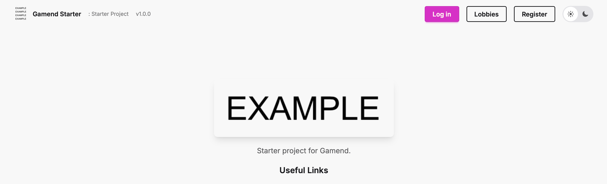

# Gamend Starter

## Run locally

1. Configure `.env` file (copy `.env.example` to `.env`).
2. Run the following:

```sh
docker compose up
```

You should now see on `localhost:4000`:



## Configure

You can configure the:
- `starter_config.json`: This has settings in webpage (eg. titles), along the reference images and css it has.
- `starter_hook.ex`: This has custom logic you can write to extend default behaviours.
- `.env`: This contains secrets (eg. oauth/email/etc.)

## Module Highlight

Run locally:

```sh
mix deps.get
mix deps.compile
```

## Deploy

1. Fork this repo.
2. Go to fly.io (or another docker provider).
3. Connect the app with the repo you forked.
4. Launch the app and set your secrets.
