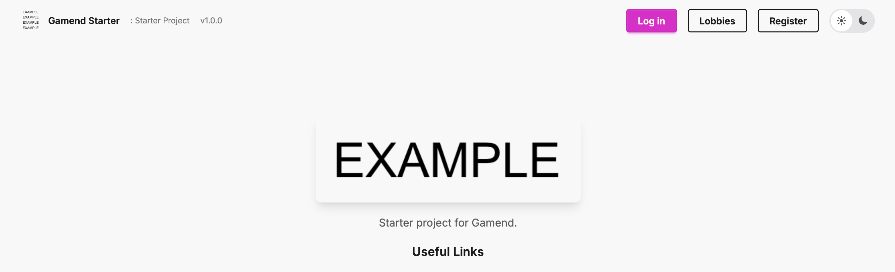

-----

**Open source _game server_ with _authentication, users, lobbies, server scripting and an admin portal_.**

Game + Backend = Gamend

-----

[Discord](https://discord.com/invite/v649emcpAu) | [Elixir Docs](https://appsinacup.github.io/game_server/) | [API Docs](https://gamend.appsinacup.com/api/docs) | [Guides](https://gamend.appsinacup.com/docs/setup) | [Deployment Tutorial](https://appsinacup.com/gamend-deploy/) | [Scaling Article](https://appsinacup.com/gamend-scaling/)

# Run locally

1. Copy `.env.example` to `.env`.
2. Install dependencies and start the app from the repo root:

```sh
mix deps.get
mix dev.start
```

The app runs on `localhost:4000` (SQLite database, device auth enabled).

## Run with Docker

Alternatively, run it in a container:

```sh
docker compose up
```

You should now see on `localhost:4000`:



## Multi-node local deployment

For multi-node deployment, you need Postgres, Redis, a scalable `app` service (Elixir nodes), and an `nginx` proxy that load-balances requests to the app replicas.

1. Configure `.env` file (copy `.env.example` to `.env`).

2. Start services with 2 app replicas:

```sh
docker compose -f docker-compose.multi.yml up --scale app=2
```

## Configure

You can configure the:
- `modules/starter_config.en.json`: Website settings (title, tagline, links) and branding paths (logo, favicon, banner, css).
- `modules/plugins/starter_hook`: An example Elixir plugin with custom hook logic. Build it so its hooks load locally: `cd modules/plugins/starter_hook && mix deps.get && mix deps.compile` (or reload it from the admin console). The Docker build compiles plugins automatically.
- `.env`: Secrets (oauth/email/etc.).
- `priv/static/theme.css`: The theme.
- `priv/static/images`: The images used in the website.

# Godot client

A minimal Godot demo project lives in [`godot/`](godot/README.md) — it logs in and
calls the example `starter_hook.hello` function over HTTP, WebSocket, and WebRTC.
See [`godot/README.md`](godot/README.md) for setup (install the Gamend SDK from the
[Asset Library](https://store.godotengine.org/asset/appsinacup/gamend-sdk/), point
it at your server, run).

# Deploy

1. Fork this repo.
2. Go to fly.io (or another docker provider).
3. Connect the app with the repo you forked.
4. Launch the app and set your secrets.
