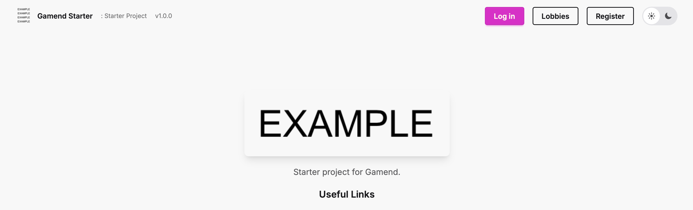

-----

**Open source _game server_ with _authentication, users, lobbies, server scripting and an admin portal_.**

Game + Backend = Gamend

-----

[Discord](https://discord.com/invite/v649emcpAu) | [Guides](https://gamend.org/docs/setup) | [API Docs](https://gamend.org/api/docs) | [Elixir Docs](https://docs.gamend.org/) | [Deployment Tutorial](https://appsinacup.com/gamend-deploy/) | [Scaling Article](https://appsinacup.com/gamend-scaling/)

# Run locally

## Prerequisites

- **Elixir 1.20 & Erlang/OTP 29** — the versions gamend's [`.tool-versions`](https://github.com/appsinacup/gamend/blob/main/.tool-versions) pins
- **Rust** ([rustup](https://rustup.rs/)) — required to build the WebRTC native dependency (`ex_sctp`)
- **PostgreSQL** — optional. Dev uses SQLite by default; set `GAMEND_DB_POSTGRES_*` or `GAMEND_DB_URL` in `.env` to use Postgres instead, then `mix deps.clean gamend_core gamend_web --build && mix compile` (the adapter is chosen at compile time).

## Run

1. Copy `.env.example` to `.env`.
2. Install dependencies and start the app from the repo root:

```sh
mix deps.get
mix dev.start
```

The app runs on `localhost:4000` (SQLite database, device auth enabled).

With a gamend checkout beside this one at `../gamend`, the engine is built from
it and edits there show up here. Without one, it comes from Hex.

## Test

```sh
mix test
mix lint        # format check, credo --strict
mix precommit   # compile, format, test, credo, API lint
```

CI also runs dialyzer, `mix deps.audit` and a Docker build.
Working on this repository, human or agent: [`AGENTS.md`](AGENTS.md).

## Run with Docker

Alternatively, run it in a container. It reads `.env`, so copy `.env.example` first:

```sh
docker compose up
```

For server plugins that run Godot headless, `Dockerfile.godot` adds Godot 4.7
on top of this image: build `docker build -t gamend-starter .` first, then
`docker build -f Dockerfile.godot .`.

You should now see on `localhost:4000`:



## Multi-node local deployment

For multi-node deployment, you need Postgres, Redis, a scalable `app` service (Elixir nodes), and an `nginx` proxy that load-balances requests to the app replicas.

1. Configure `.env` file (copy `.env.example` to `.env`).

2. Start services with 2 app replicas:

```sh
docker compose -f docker-compose.multi.yml up --scale app=2
```

## Configure

You can configure the:
- `modules/starter_config.json`: Website settings (title, tagline, links) and branding paths (logo, favicon, banner, css).
- `modules/plugins/starter_hook`: An example Elixir plugin with custom hook logic. Build it so its hooks load locally: `cd modules/plugins/starter_hook && mix deps.get && mix compile && mix plugin.bundle` (or reload it from the admin console). The Docker build compiles plugins automatically.
- `.env`: Secrets (oauth/email/etc.). `.env.example` lists every `GAMEND_*` setting and is generated: run `mix gamend.settings.env_example` after a gamend update. It leaves out `SENTRY_DSN`, which the bundled Sentry client reads itself; nothing sends errors to Sentry until you add its logger handler (`Sentry.LoggerHandler`).
- `priv/static/theme.css`: The theme.
- `priv/static/images`: The images used in the website.

# Godot client

A minimal Godot demo project lives in [`godot/`](godot/README.md) — it logs in and
calls the example `starter_hook.hello` function over HTTP, WebSocket, and WebRTC.
See [`godot/README.md`](godot/README.md) for setup (install the Gamend SDK from the
[Asset Library](https://store.godotengine.org/asset/appsinacup/gamend-sdk/), point
it at your server, run).

# Deploy

1. Fork this repo.
2. Go to fly.io (or another docker provider).
3. Connect the app with the repo you forked.
4. Launch the app and set your secrets. The `GAMEND_AUTH_SECRET_KEY_BASE` in `fly.toml` and `docker-compose.yml` is a public placeholder: generate your own with `mix phx.gen.secret`.
